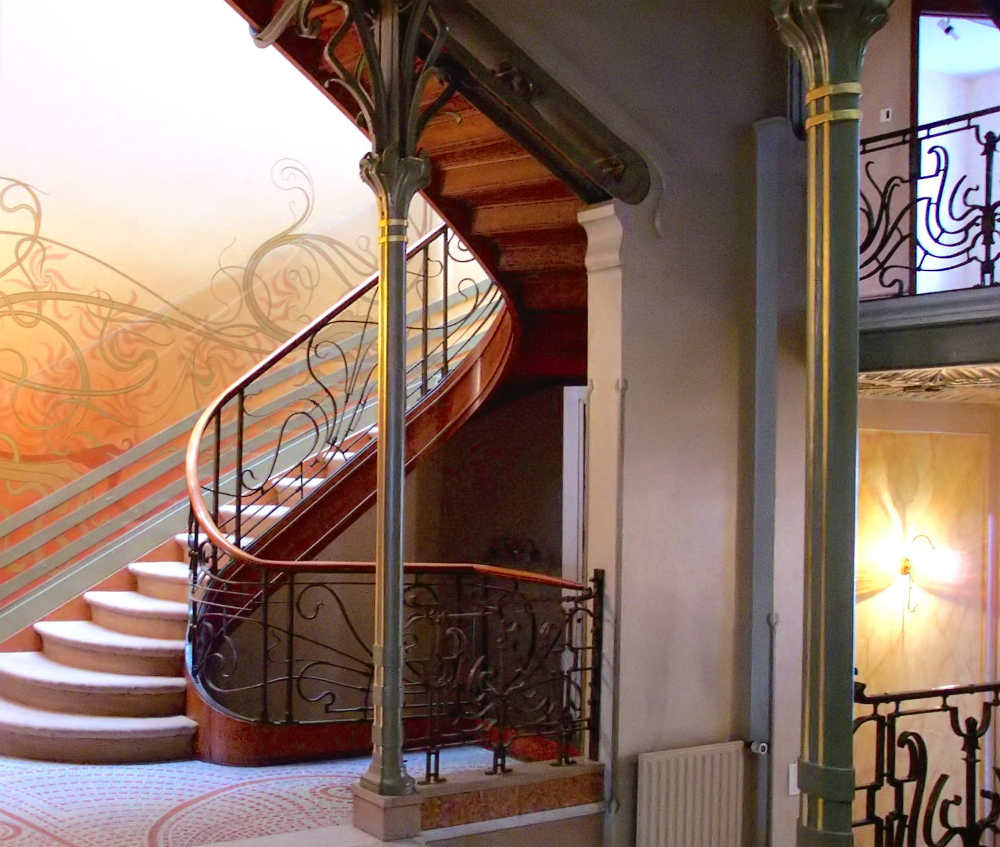
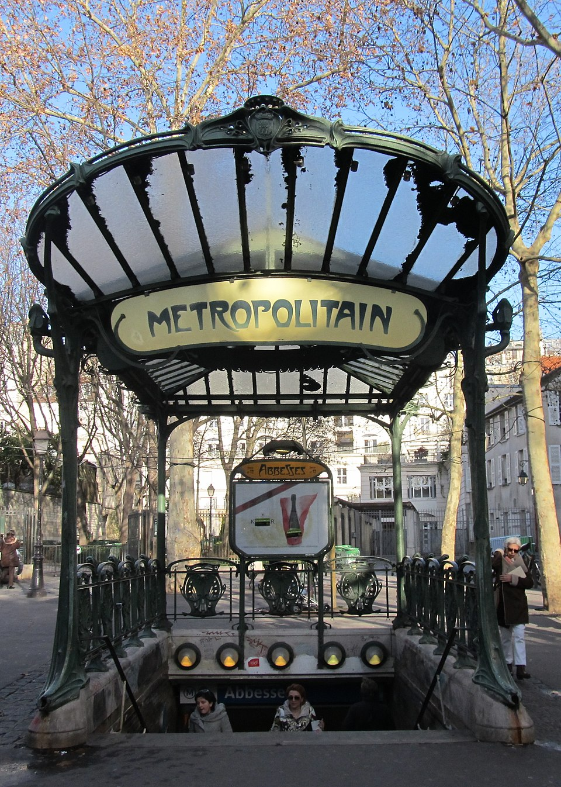
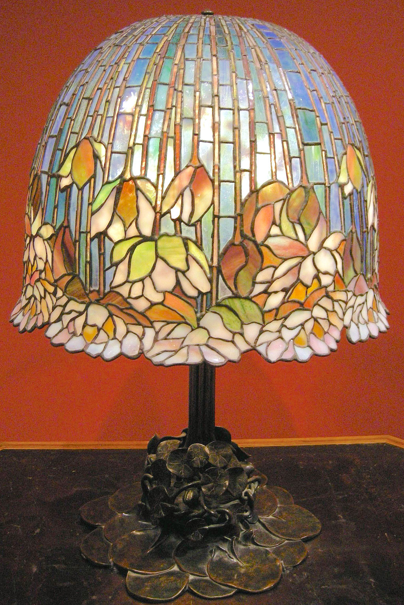
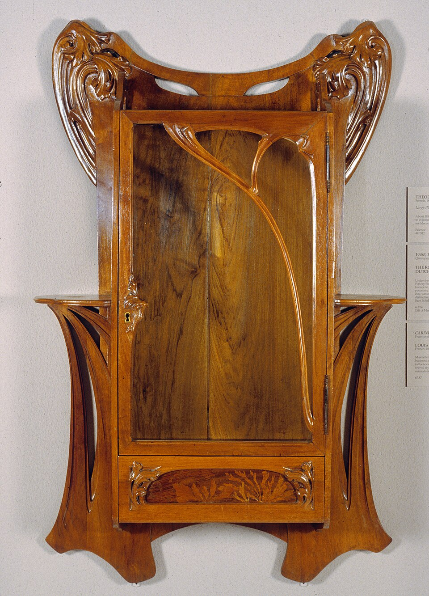
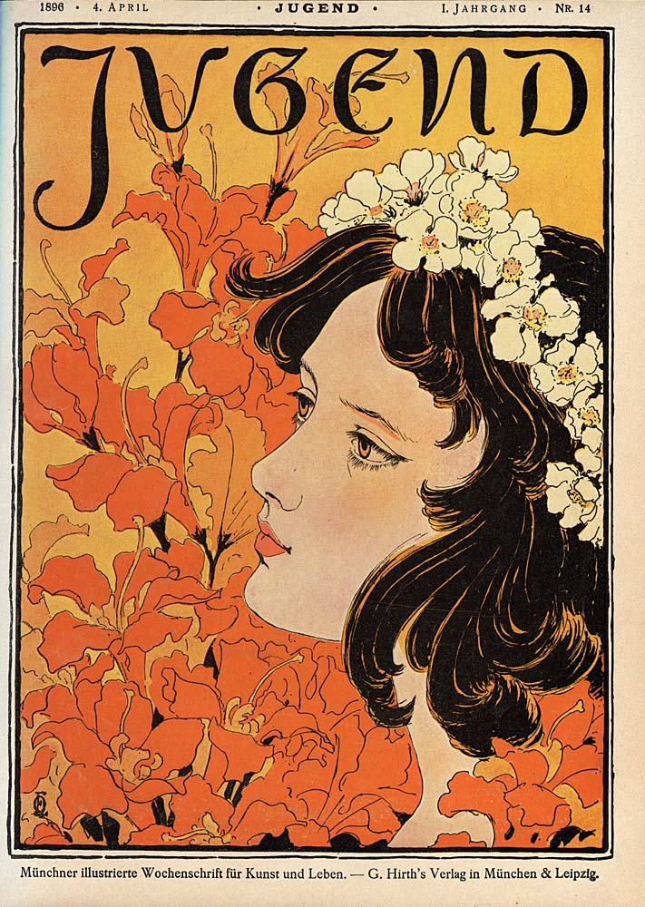

# Art Nouveau — Key Examples Reference
## DSGN 230 — Companion to lesson-art-nouveau

---

## Architecture

**Hôtel Tassel** — Victor Horta, 1893, Brussels, Belgium

Widely considered the first Art Nouveau building. Open floor plan around a central staircase, exposed iron columns as organic decoration, mosaic floors, painted walls, and stained-glass ceiling unified into a single vision. UNESCO World Heritage Site.

**Hôtel Solvay** — Victor Horta, 1894–1898, Brussels, Belgium
Private townhouse for industrialist Armand Solvay. Lavish interiors with custom furniture, ironwork, and stained glass — a complete Gesamtkunstwerk. UNESCO World Heritage Site.

**Hôtel van Eetvelde** — Victor Horta, 1895–1898, Brussels, Belgium
Built for a diplomat; notable for its winter garden with iron-and-glass dome and African-wood interiors. UNESCO World Heritage Site.

**Horta House and Studio** — Victor Horta, 1898–1901, Brussels, Belgium
Now the Horta Museum. Demonstrates Art Nouveau principles applied to the architect's own living and working space. UNESCO World Heritage Site.

**Castel Béranger** — Hector Guimard, 1895–1898, Paris, France
An apartment building that established Guimard's reputation. Won a City of Paris facade competition in 1898. Wrought-iron gates, ceramic detailing, and asymmetric ornamentation throughout.

**Paris Métro Entrances** — Hector Guimard, 1900–1913, Paris, France
Cast-iron and glass canopies in three standardized designs, industrially produced. Green-painted organic ironwork with amber glass lamps. 86 of the original 167 survive as protected monuments.

**Abbesses Métro Station Entrance (édicule)** — Hector Guimard, c. 1900, Paris, France
One of only two surviving full glass-canopied *édicule* entrances (the other is at Porte Dauphine). Originally installed at Hôtel de Ville, relocated to Abbesses in 1974. The fan-shaped glass and iron canopy is the most complete example of Guimard's Métro design.

**Casa Batlló** — Antoni Gaudí, 1904–1906, Barcelona, Spain
Renovation of an existing apartment building into a marine-organic fantasy. Undulating stone facade, bone-like balconies, dragon-spine roofline, shimmering trencadís mosaic. UNESCO World Heritage Site.

**Casa Milà (La Pedrera)** — Antoni Gaudí, 1906–1912, Barcelona, Spain
Apartment building with a rippling stone facade resembling ocean waves or eroded cliffs. Rooftop sculptural chimneys, open-plan interiors, no load-bearing walls. UNESCO World Heritage Site.

**Park Güell** — Antoni Gaudí, 1900–1914, Barcelona, Spain
A residential park development featuring mosaic-covered terraces, organic stone viaducts, and the iconic mosaic salamander fountain. UNESCO World Heritage Site.

**Sagrada Família** — Antoni Gaudí, 1883–present, Barcelona, Spain
Basilica combining Gothic and Art Nouveau forms with nature-derived structural systems: tree-like columns, hyperboloid vaults, parabolic arches. Still under construction over a century after Gaudí's death.

**Glasgow School of Art** — Charles Rennie Mackintosh, 1897–1909, Glasgow, Scotland
Mackintosh's masterwork in two phases (East Wing 1897–1899, West Wing 1907–1909). Spare rectilinear forms combined with subtle organic touches, Japanese-influenced interiors, and masterful use of natural light.

**Palau de la Música Catalana** — Lluís Domènech i Montaner, 1905–1908, Barcelona, Spain
Concert hall with an extraordinary stained-glass skylight, sculptural facades, and richly decorated interiors combining floral mosaic, ironwork, and ceramic ornament. UNESCO World Heritage Site.

**Vienna Stadtbahn Stations** — Otto Wagner, 1894–1897, Vienna, Austria
Stations, bridges, and viaducts for the Vienna city rail system. Elegant ironwork, tile decoration, and Jugendstil ornamentation applied to civic infrastructure.

**Austrian Postal Savings Bank (Postsparkasse)** — Otto Wagner, 1904–1906, Vienna, Austria
Curving glass roof over the main banking hall, aluminum-bolted marble facade. A transitional work bridging Art Nouveau decoration with early modernist rationality.

**Villa Bloemenwerf** — Henry van de Velde, 1895–1896, Uccle (Brussels), Belgium
Van de Velde's private residence, designed as a total environment — architecture, furniture, wallpaper, even his wife's dresses were part of a unified aesthetic program.

**Villa Majorelle** — Henri Sauvage (architect), Louis Majorelle (furniture), 1901–1902, Nancy, France
A collaborative Gesamtkunstwerk: Sauvage designed the building, Majorelle the furniture, Alexandre Bigot the ceramics, and Jacques Grüber the stained glass.

**Secession Building** — Joseph Maria Olbrich, 1897–1898, Vienna, Austria
Exhibition hall for the Vienna Secession artists. Known for its gilded openwork dome of laurel leaves and the inscription "To every age its art, to every art its freedom."

---

## Glass

**Tiffany Wisteria Lamp** — Louis Comfort Tiffany / Clara Driscoll (designer), c. 1901, New York, USA
Bronze tree-trunk base supporting a shade of cascading wisteria blossoms in opalescent Favrile glass. Among the most iconic Art Nouveau decorative objects.

**Tiffany Dragonfly Lamp** — Louis Comfort Tiffany / Clara Driscoll, c. 1899–1906, New York, USA
Jeweled dragonfly wings in leaded glass with cabochon "eyes." Demonstrates the copper-foil technique that allowed more intricate organic designs than traditional lead came.

**Tiffany Pond Lily Table Lamp** — Louis Comfort Tiffany, c. 1900–1910, New York, USA

Bronze base of lily pad stems supporting twelve opalescent Favrile glass shades shaped as opening lily blossoms. Each shade glows individually, creating a naturalistic cluster of light. One of the most recognizable Tiffany Studios lamp designs.

**Tiffany Magnolia Window** — Louis Comfort Tiffany, c. 1900, New York, USA
Large-scale stained glass depicting magnolia branches in bloom. Opalescent glass creates painterly depth without the use of paint on the glass surface.

**Gallé Cameo Glass Vases** — Émile Gallé, 1880s–1904, Nancy, France
Layered colored glass, acid-etched and engraved to reveal botanical imagery beneath — flowers, dragonflies, landscapes. Elevated glasswork to fine art status.

**Gallé "Les Coprins" Table Lamp** — Émile Gallé, c. 1902, Nancy, France
Mushroom-form lamp in layered glass with organic carved wood base. Demonstrates the integration of glass and nature-derived form.

**Daum Brothers Glass** — Auguste and Antonin Daum, 1890s–1910s, Nancy, France
Pâte de verre (glass paste) and cameo glass pieces rivaling Gallé in technical sophistication. Floral and landscape motifs with rich, translucent color.

**Loetz Iridescent Glass** — Glasfabrik Johann Loetz Witwe, 1890s–1910s, Klostermühle, Bohemia (now Czech Republic)
Bohemian art glass with metallic iridescent surfaces achieved through chemical treatment. Organic, undulating forms in blues, greens, and golds.

---

## Jewelry

**Dragonfly Woman Corsage Ornament** — René Lalique, c. 1897–1898, Paris, France
A hybrid female-dragonfly figure in gold, enamel, chrysoprase, moonstone, and diamonds. Now in the Calouste Gulbenkian Museum, Lisbon. One of the most famous Art Nouveau jewelry pieces.

**Serpent Pectoral** — René Lalique, c. 1898–1899, Paris, France
Intertwined enamel snakes with gemstone accents. Demonstrates Lalique's interest in nature's darker, less conventionally "beautiful" creatures.

**Peacock Diadem** — René Lalique, c. 1897–1898, Paris, France
Enamel and gemstone tiara featuring stylized peacock feathers. Design-driven rather than gem-driven — the hallmark of Lalique's approach.

**Fouquet Bracelet and Ring** — Georges Fouquet (designed by Alphonse Mucha), 1899, Paris, France
A connected bracelet and ring in gold, enamel, and gemstones created for Sarah Bernhardt. Mucha's ornamental graphic style translated into wearable form. Now in the Petit Palais, Paris.

---

## Furniture

**Majorelle "Nénuphar" (Water Lily) Desk** — Louis Majorelle, c. 1902–1905, Nancy, France
Carved mahogany desk with water lily and dragonfly bronze mounts. Flowing organic lines unify the wooden structure with metal fittings.

**Majorelle "Orchidée" Cabinet** — Louis Majorelle, c. 1903, Nancy, France
Display cabinet with orchid marquetry and bronze ornamental hardware. Demonstrates the Nancy School's botanical naturalism.

**Majorelle Wall Cabinet** — Louis Majorelle, late 19th century, Nancy, France

Fruit wood with marquetry inlay in the sinuous Nancy School style, with rich vegetal decoration inspired by Japanese design. Collection of the Walters Art Museum, Baltimore (accession no. 65.87).

**Gallé Marquetry Tables** — Émile Gallé, 1890s–1904, Nancy, France
Furniture featuring elaborate wood-inlay imagery of landscapes, flowers, insects, and literary quotations.

**Mackintosh High-Back Chair** — Charles Rennie Mackintosh, 1897–1900, Glasgow, Scotland
Tall, narrow, ladder-back chair with attenuated proportions and subtle oval cutouts. Demonstrates the Glasgow Style's geometric restraint within Art Nouveau.

**Bugatti "Snail" Room Suite** — Carlo Bugatti, c. 1902, Milan, Italy
Furniture with hammered copper, parchment, and painted decoration incorporating Moorish and Japanese motifs. An eccentric Italian contribution to Art Nouveau furniture.

---

## Posters and Graphic Art

**Gismonda** — Alphonse Mucha, 1895, Paris, France
Tall lithographic poster for Sarah Bernhardt. Idealized female figure in Byzantine-inspired robes, ornamental arch, mosaic-pattern background, integrated typography. The poster that launched Mucha's career and the "Mucha style."

**Médée** — Alphonse Mucha, 1898, Paris, France
Poster for Bernhardt's role as Medea. Dark-haired figure with a bloodied dagger, within Mucha's signature decorative framing.

**Job Cigarette Papers** — Alphonse Mucha, 1896, Paris, France
Commercial poster with a woman exhaling smoke amid flowing hair and ornamental curves. Demonstrates Art Nouveau's penetration into mass-market advertising.

**The Seasons (series)** — Alphonse Mucha, 1896, Paris, France
Four decorative panels personifying spring, summer, autumn, and winter as female figures surrounded by seasonal flora. Among Mucha's most reproduced works.

**Salomé Illustrations** — Aubrey Beardsley, 1894, London, England
Black-ink illustrations for Oscar Wilde's play. Erotic, grotesque, and darkly beautiful — demonstrating Art Nouveau's capacity for psychological provocation. Japanese woodcut influence visible in the bold black-and-white contrasts.

**Le Morte d'Arthur Illustrations** — Aubrey Beardsley, 1893, London, England
Beardsley's first major commission. Intricate pen-and-ink borders and illustrations for Malory's Arthurian text, blending medieval imagery with Art Nouveau line.

**The Yellow Book Covers** — Aubrey Beardsley, 1894, London, England
Cover illustrations for the literary quarterly associated with the Aesthetic and Decadent movements.

**Tropon Poster** — Henry van de Velde, 1899, Belgium
Advertisement for a food concentrate. One of the earliest examples of abstract Art Nouveau graphic design — organic curves derived from egg whites being separated, stripped of literal representation.

**Privat-Livemont Posters** — Henri Privat-Livemont, 1890s–1900s, Brussels, Belgium
Advertising posters in a style closely related to Mucha's, featuring idealized female figures and floral borders. Includes work for Absinthe Robette (1896) and Cacao Van Houten.

***Jugend* Magazine Cover, No. 14** — Otto Eckmann, 4 April 1896, Munich, Germany

Cover of the art and literary weekly that gave the German variant of Art Nouveau its name — *Jugendstil* ("Youth Style"). Eckmann's organic, flowing illustration epitomizes the movement's fusion of typography, image, and decorative form. Published by Georg Hirth in Munich.

---

## Painting

**The Kiss** — Gustav Klimt, 1907–1908, Vienna, Austria
Two figures dissolving into ornamental gold and geometric pattern. Painted during Klimt's "Golden Period." Purchased by the Austrian government while unfinished. Now in the Belvedere Palace, Vienna.

**Portrait of Adele Bloch-Bauer I** — Gustav Klimt, 1907, Vienna, Austria
Gold-leaf portrait merging the sitter's face and hands with abstract decorative fields. Byzantine mosaic influence fused with Viennese Sezessionstil.

**Beethoven Frieze** — Gustav Klimt, 1902, Vienna, Austria
Monumental wall painting created for the Secession Building's 14th exhibition, interpreting Beethoven's Ninth Symphony. Combines figural painting with ornamental gold surfaces and abstract pattern.

**Judith and the Head of Holofernes** — Gustav Klimt, 1901, Vienna, Austria
An ecstatic female figure in gold-decorated garment. Demonstrates Klimt's fusion of eroticism, ornament, and classical subject matter.

---

## Ceramics and Tile

**Zsolnay Eosin-Glazed Ceramics** — Zsolnay Porcelain Manufactory, 1890s–1910s, Pécs, Hungary
Lustrous eosin glaze creating iridescent metallic surfaces on vases and architectural tiles. Used extensively on Hungarian Art Nouveau buildings.

**Gaudí Trencadís Mosaics** — Antoni Gaudí, 1900s, Barcelona, Spain
Broken-tile mosaic technique covering benches, rooftops, and facades at Park Güell, Casa Batlló, and other buildings. Colorful, irregular, and organic.

**Bigot Architectural Ceramics** — Alexandre Bigot, 1890s–1900s, Paris and Nancy, France
Stoneware tiles and facade elements for Art Nouveau buildings, including the Villa Majorelle. Matte and semi-glazed finishes with organic relief patterns.

---

## Interior Design (Gesamtkunstwerk Examples)

**Hôtel Tassel Interior** — Victor Horta, 1893, Brussels, Belgium
The benchmark for Art Nouveau total design: iron columns, mosaic floors, painted walls, stained-glass ceiling, and custom furniture unified by a continuous organic vocabulary.

**Maison de l'Art Nouveau Interior** — Henry van de Velde, 1895, Paris, France
Van de Velde's interior design for Siegfried Bing's gallery — the space that gave the movement its name.

**Willow Tea Rooms** — Charles Rennie Mackintosh, 1903, Glasgow, Scotland
Complete interior design including furniture, light fixtures, wall decoration, and stained glass. The high-backed chairs and geometric paneling represent the Glasgow Style at its most refined.

**Wiener Werkstätte Productions** — Josef Hoffmann, Koloman Moser, et al., 1903–1932, Vienna, Austria
Furniture, metalwork, textiles, ceramics, and fashion produced as unified design programs. More geometric than other Art Nouveau interiors, pointing toward Art Deco and early modernism.

---

*Prepared for DSGN 230 — Survey of Design History*
*Companion reference for lesson-art-nouveau*
